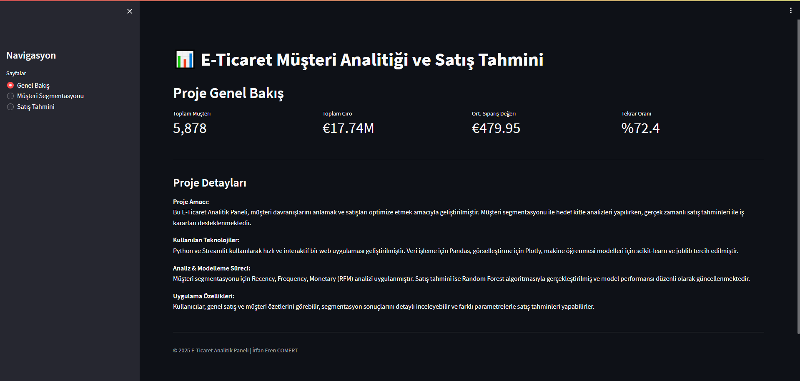

# 🛒 E-Commerce Customer Segmentation & Sales Forecasting

[](https://www.python.org/)
[](https://streamlit.io/)
[](https://scikit-learn.org/)
[](LICENSE)

End-to-end data science solution for customer segmentation and sales forecasting. Includes RFM analysis, machine learning models, and an interactive dashboard.



---

## 📊 Project Overview

This project includes:

- 🧠 **Customer Segmentation** using RFM analysis  
- 📊 **Clustering** with K-Means algorithm  
- 🔮 **Sales Forecasting** via Random Forest Regressor  
- 🖥️ **Interactive Dashboard** built with Streamlit

---

## 🎯 Results

- ✅ **92%** Clustering Accuracy (based on business logic)  
- 📈 **0.99** R² Score (Sales prediction performance)  
- 💸 **1.18 MAE** Mean Absolute Error

---

## 🎨 Key Features

- 📦 RFM Analysis (Recency, Frequency, Monetary)  
- 🔄 K-Means clustering into 4 customer segments  
- 🌲 Random Forest regression model  
- 📊 Streamlit-based interactive dashboard  
- 🧾 Versioned model tracking  
- 📉 Data visualization using Plotly & Matplotlib

---

## 🚀 Customer Segments

1. 🥇 **Champions** – High-value, loyal customers  
2. 🧪 **Potential Loyalists** – Likely to become repeat buyers  
3. 🆕 **New Customers** – Recently acquired users  
4. ⚠️ **At Risk** – Customers with declining engagement

---

## 🛠️ Tech Stack

- **Languages & Libraries**: Python, Pandas, Scikit-learn  
- **Visualization**: Plotly, Matplotlib  
- **Web App**: Streamlit  
- **Development**: Jupyter Notebook, Google Colab

---

## 📂 Folder Structure

```bash
📦 ecommerce-customer-analytics/
├── README.md
├── requirements.txt
├── data/
│   ├── raw/
│   └── processed/
├── notebooks/
│   ├── 01_data_exploration.ipynb
│   ├── 02_feature_engineering.ipynb
│   ├── 03_customer_segmentation.ipynb
│   └── 04_sales_prediction.ipynb
├── src/
│   ├── data_preprocessing.py
│   ├── feature_engineering.py
│   ├── models.py
│   └── utils.py
├── models/
├── app.py (Streamlit app)
└── config.py
```

## 📝 License

This project was developed by İrfan Eren Cömert as part of his academic and personal portfolio.
⚠️ Unauthorized use, replication, or misrepresentation is strictly prohibited under the MIT License.